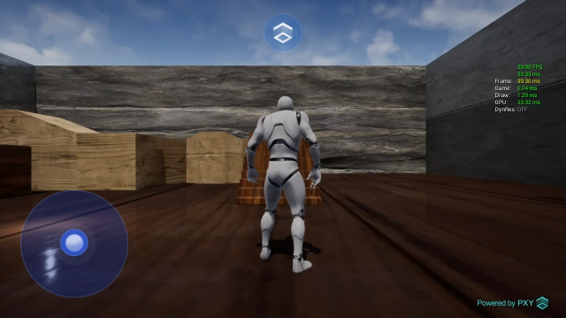
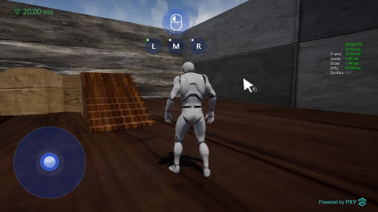
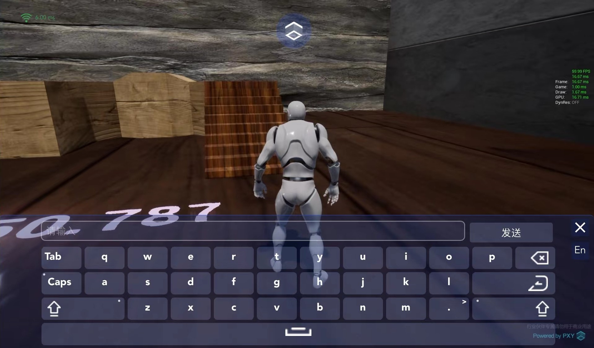
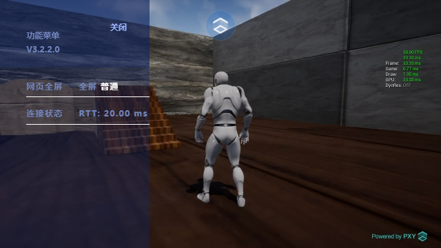
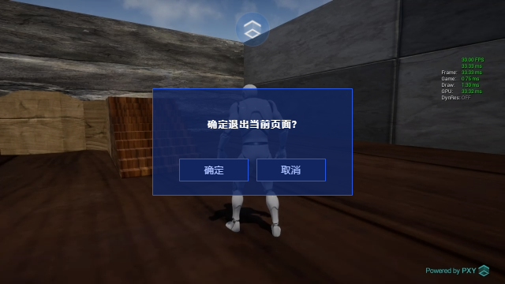

# LarkSR SDK Vue 使用 Demo

## 使用本 Demo

初始化

```cmd
yarn
```

运行

```cmd
yarn run serve
```

查看示例代码 `src/App.vue`


## 安装 LarkSR SDK

```cmd
yarn add larksr_websdk
```

## 引入

```javascript
import { CreateLarkSRClientFromeAPI } from "larksr_websdk";
```
> 需要修改 authCode 为您的 authCode；

## 效果









